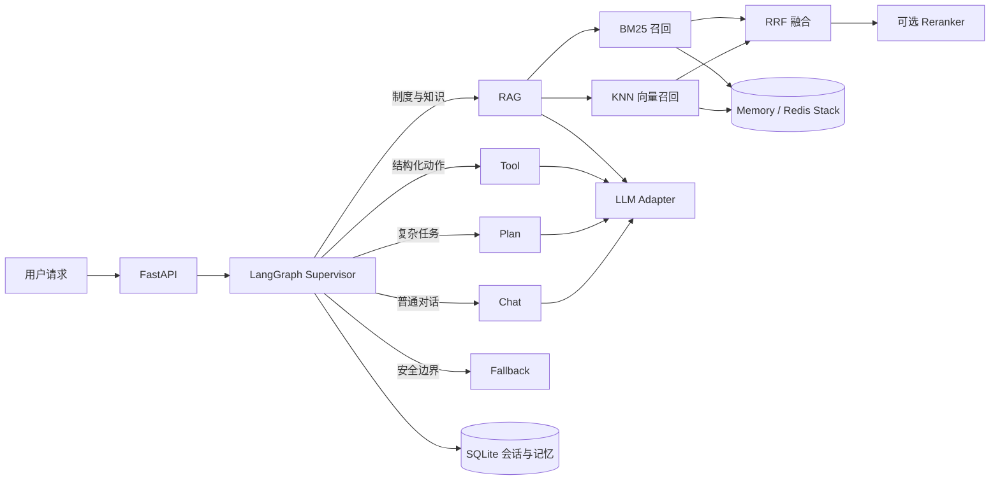

# Agentic RAG Platform｜企业制度与办事智能助手

GitHub：<https://github.com/shmoon250216-sys/agentic-rag-platform>

面向企业制度、报销规范和办事材料分散的场景，系统把文档入库、混合检索、来源引用、工具调用、任务规划、会话记忆和异常兜底组织为一条可运行的 Agent 工作流。用户可以上传 PDF/DOCX 制度文档，通过统一聊天入口查询规则、调用工具或生成办事计划，并在管理接口中追踪会话、记忆和工作流快照。

## 解决的问题

- **入口分散**：将知识问答、结构化工具和复杂任务规划统一到一个聊天接口，由 Supervisor 决定执行分支。
- **文档难检索**：解析 PDF/DOCX 后切分文档，分别执行 BM25 关键词召回和向量召回，通过 RRF 融合排名，并可选用 Reranker 精排；回答同时返回来源片段。
- **连续服务缺少上下文**：使用 SQLite 保存会话和用户级长期记忆，并记录每次图运行的最终状态快照。
- **外部依赖影响本地开发**：默认使用确定性的本地模型和 Hash Embedding，LLM、Embedding 与 Redis Stack 均通过适配层切换。
- **修改容易破坏链路**：固定评测覆盖 RAG、工具、规划、聊天和安全兜底，并以自动化测试验证文档、缓存、记忆和接口行为。

## 核心流程



## 已实现能力

- FastAPI 服务、Token 校验、统一聊天接口和 SSE 流式响应。
- LangGraph `StateGraph`，包含 `rag`、`tool`、`plan`、`chat`、`fallback` 五类分支。
- PDF/DOCX 上传校验、文本解析、重叠切分、BM25/向量双路召回、加权 RRF 融合和来源返回。
- 可配置 HTTP Reranker；服务超时或响应异常时按配置回退到 RRF 排名。
- 本地 Hash Embedding 与 OpenAI-compatible Embedding 适配器。
- 内存知识库与 Redis Stack 检索后端；Redis 使用中文全文 BM25 与 RediSearch KNN 索引。
- SQLite 会话记录、用户级长期记忆、敏感信息过滤和图状态审计快照。
- MCP 风格工具注册表、参数 Schema 校验和标准化工具结果。
- TTL 检索缓存与回答缓存，文档变更时主动失效。
- 存活/就绪检查、Docker Compose、质量门禁与自动化测试。

## 快速启动

要求 Python 3.11+。

```powershell
python -m venv .venv
.\.venv\Scripts\Activate.ps1
pip install -e ".[dev]"
Copy-Item .env.example .env
uvicorn app.main:create_app --factory --reload --port 8010
```

启动后访问：

- 操作界面：<http://127.0.0.1:8010/docs>
- API 文档：<http://127.0.0.1:8010/api/docs>
- 存活检查：<http://127.0.0.1:8010/health>
- 依赖检查：<http://127.0.0.1:8010/health/ready>

```powershell
curl -X POST "http://127.0.0.1:8010/api/v1/chat" `
  -H "Content-Type: application/json" `
  -H "Authorization: Bearer dev-token" `
  -d '{"message":"差旅住宿标准是什么？","user_id":"demo-user"}'
```

## 真实文档验证

`examples/documents/` 提供一份 8 页的企业差旅与费用报销制度测试 PDF；`examples/evaluation_questions.json` 给出预期查询方向。该文档用于验证上传、解析、切分、召回和引用链路，不含真实企业或个人数据。

```powershell
python scripts/run_evaluation.py
pytest -q
```

当前测试集共收集 78 项；本地环境中 77 项通过，1 项 Redis Stack 集成测试在未启动 Redis 时跳过。评测数据与结果见 `app/evaluation/`、`docs/evaluation-results.json` 和 `docs/retrieval-evaluation-results.json`。

检索专项评测使用仓库内 8 页、5764 字的合成制度文档和 8 个标注问题。当前离线 Hash Embedding 不具备真实语义能力，因此默认将 BM25/RRF 权重设为 `1.0/0.1`；专项结果中 BM25 的 Recall@3 为 100%，RRF 的 Recall@3 为 87.5%。该结果用于暴露本地向量模型的限制，不包装为线上效果。切换真实 Embedding 后应重新标定权重。

```powershell
python scripts/evaluate_retrieval.py
```

## 检索与精排配置

默认不依赖外部模型，使用 BM25 与低权重 Hash 向量结果做 RRF 融合：

```text
RAG_CANDIDATE_MULTIPLIER=4
RAG_RRF_K=60
RAG_BM25_WEIGHT=1.0
RAG_VECTOR_WEIGHT=0.1
RERANK_PROVIDER=none
```

接入支持 `model/query/documents/top_n` 请求格式以及 `results[index,relevance_score]` 响应格式的 HTTP Reranker 时：

```text
RERANK_PROVIDER=http
RERANK_URL=https://your-rerank-service/v1/rerank
RERANK_API_KEY=your-key
RERANK_MODEL=your-reranker-model
RERANK_CANDIDATE_COUNT=12
RERANK_FAIL_OPEN=true
```

系统先取 RRF 候选，再调用精排服务；`RERANK_FAIL_OPEN=true` 时，精排服务不可用不会阻断知识问答，而是保留 RRF 顺序。

## 配置与边界

- 默认 `FakeLLMClient` 用于离线、确定性开发；配置 OpenAI-compatible Provider 后才会生成模型回答。
- 默认 Hash Embedding 侧重可复现与零外部依赖，专项评测已显示它会给 RRF 引入噪声；真实语义检索效果需要配置外部 Embedding 模型后重建索引并重新评测。
- Supervisor 与工具选择当前采用规则决策；`plan` 分支输出结构化计划，不执行自主多步工具循环。
- SQLite 保存会话、长期记忆和最终图状态快照；当前 LangGraph checkpointer 为进程内实现，不支持跨进程从中间节点续跑。
- Redis Stack 双路检索代码与可选集成测试已包含；当前本机未安装 Docker，因此 Redis 实机用例仍按环境条件跳过。
- HTTP Reranker 的请求、排序和故障回退由自动化测试覆盖，但仓库不附带第三方模型密钥，也不宣称完成真实模型效果评测。
- 开发 Token 与客户端传入的 `user_id` 适合本地验证，不等同于企业多租户鉴权。

详细设计见 [`docs/architecture.md`](docs/architecture.md)，部署配置见 [`docs/deployment.md`](docs/deployment.md)。
